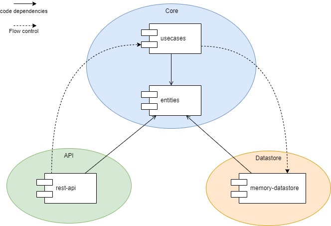

# ScalableWeb

## Table of Contents

**[Architecture](#Architecture)**
  * [Components](#Components)
  * [Deployment](#Deployment)

**[DevOps](#DevOps)**

## Architecture

### Components

The solution is composed of the following components:
 * Core. Main component that contains business logic. Is composed of the following low level components:
    * entities. This component has all domain classes, exceptions and interfaces (without implementations).
    * usecases. This component has implementations of the business logic exposed through interfaces located in entities.
 * API. This component has the modules used to expose the API of the solution.
    * rest-api. API exposed through a series of REST endpoints.
 * Datastore. This component has the modules used to store the state of the solution.
    * memory-datastore. Implementation that stores the state in memory.

### Deployment

## DevOps
